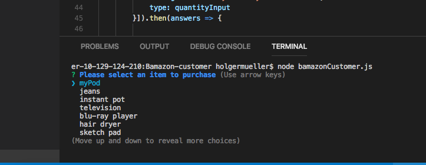
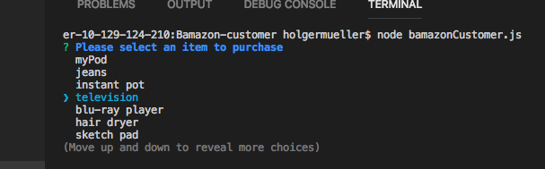
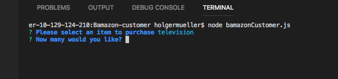
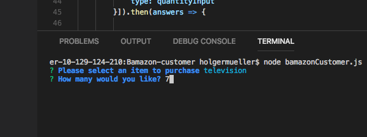
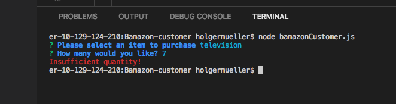
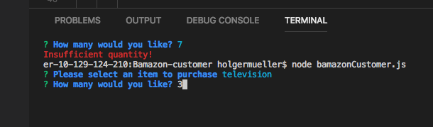
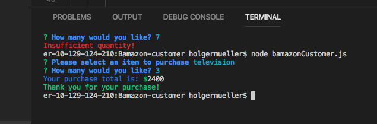
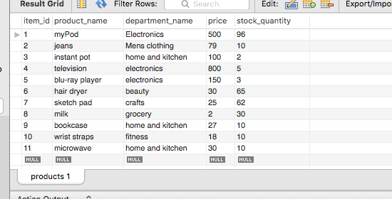
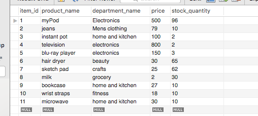

# Bamazon

## A node powered online shopping center.

This command-line CRUD application simulates a warehouse inventory database. It was completed as part of the full-stack web development course I took at the University of Minnesota's College of Continuing Education.

### See it work:

#### Bamazon Customer:

1. First, cd into the Bamazon-customer directory and run the command **node bamazonCustomer.js** in your terminal.



2. Node then displays the _list_ of items in the databse.
3. Select which _item_ you'd like to buy.



4. Once you've selected the item you'd like to buy, enter the _quantity_ you'd like to purchase.





5. If you there isn't enough stock to fulfill the order, this message will appear in **red**.



6. However, if there is enough stock to fulfill the order, this message will appear:





7. At the same time, the quantity of the ordered item will be subtracted from the MySQL database, which you can view through your workbench.





### How to install this project

To gain a deeper understaning of this project

1. Clone the project
2. CD into the Bamazon-customer directory and run npm install
3. In stockit.js, replace this values in this object with your own:

```js
const connection = mysql.createConnection({
  host: "localhost",
  port: "xxxx",
  user: "xxxx",
  password: "xxxx",
  database: "bamazon_DB",
});
```

4. From here, you can follow along with the steps in the 'See It Work' section

### Before you start

In addition to downloading the npm packages in the package.json, you'll also need your own MySQL workbench to connect to.

You'll also need a terminal, integrated or otherwise, through which to run the commands. This demonstraton uses an integrated terminal.

### Contribute to this project

This project was built as part of a bootcamp, so I'm not really keeping up on it anymore. That said, if there's a feature you'd like to add, or if you like to use this as a starting point for something else, feel free to fork and clone this project.

### Find a bug?

If you discover an issue that you'd love to take care of, please feel free to create an issue. After this you can create a pull request and reference the issue you created.

### Like this project?

Think this is cool? Did it help you finish your own bootcamp homework assignment that you just couldn't figure out on your own? Cool! You're welcome to [buy me a coffee](https://ko-fi.com/holgermuellerart)! In case your confused by what you see after clicking the link, it goes to a site where I'm attempting to fund another passion project.
